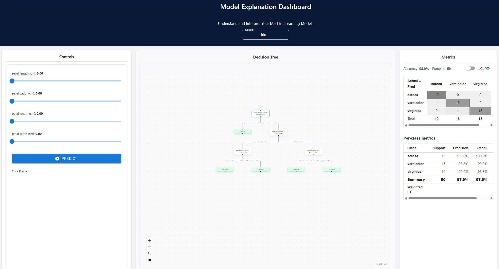
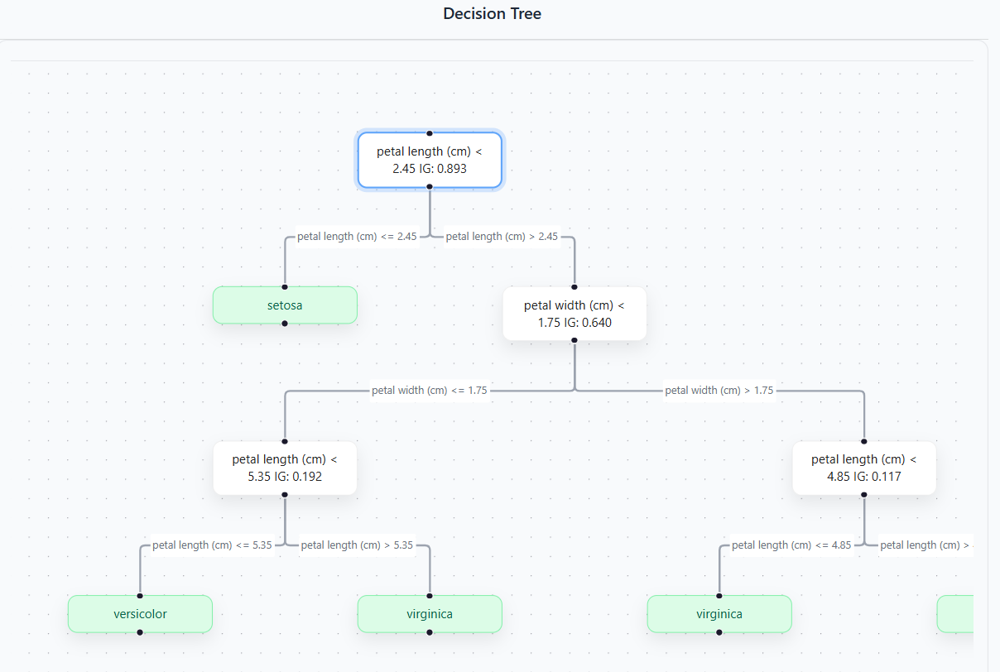
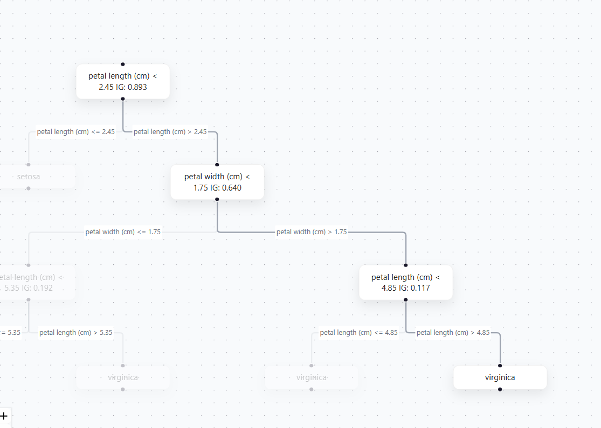
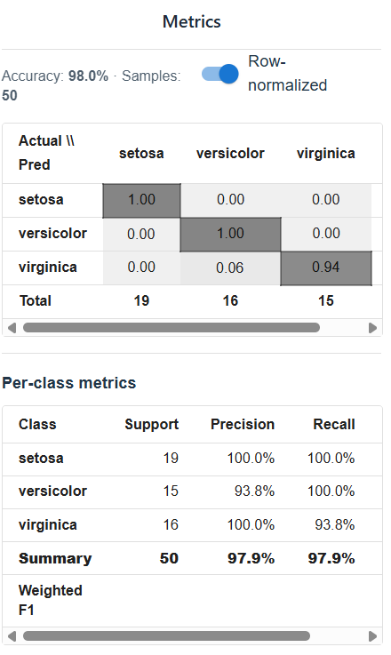

# Model Explanation Dashboard 🧠🌳
An interactive dashboard that visualizes a Decision Tree model, shows prediction paths, and surfaces interpretable metrics, built to make **model behavior feel tangible** (not just numbers on a page).

> **Goal:** Help learners build intuition for *how* a model makes decisions by connecting:
> **data → training → tree structure → prediction path → metrics** in one UI.

---

## Table of Contents
- [Project Overview](#project-overview)
- [Why I Built It](#why-i-built-it)
- [Key Features](#key-features)
- [Screenshots](#screenshots)
- [Architecture](#architecture)
- [Tech Stack](#tech-stack)
- [How It Works (Deep Dive)](#how-it-works-deep-dive)
  - [1) Backend: Training + Exporting an Explainable Tree](#1-backend-training--exporting-an-explainable-tree)
  - [2) DTO Layer: Making ML Output UI-Friendly](#2-dto-layer-making-ml-output-ui-friendly)
  - [3) Frontend: Visual + Interactive Explanation](#3-frontend-visual--interactive-explanation)
  - [4) Metrics: What the Dashboard Teaches](#4-metrics-what-the-dashboard-teaches)
- [Folder Structure](#folder-structure)
- [Setup & Run Locally](#setup--run-locally)
  - [Backend](#backend)
  - [Frontend](#frontend)
- [API Endpoints (Expected)](#api-endpoints-expected)
- [Design Choices & Learning Takeaways](#design-choices--learning-takeaways)
- [Troubleshooting](#troubleshooting)
- [Roadmap](#roadmap)

---

## Project Overview
**Model Explanation Dashboard** is a full-stack project that lets you:
- Train / load a Decision Tree model,
- Export its structure into a UI-ready format,
- Visualize it as a graph,
- Run predictions from user-controlled inputs,
- Highlight the *exact path* the model took to reach its decision.
- Display evaluation metrics (e.g., confusion matrix, accuracy, precision, recall) to contextualize the model’s predictive performance alongside its decision logic.

This project is deliberately designed for **learning and teaching**:
it turns “black box” model behavior into something you can explore step-by-step.

---

## Why I Built It
When learning ML, it’s easy to get stuck at:
- “I trained a model and got accuracy.”
…but did not really understand:
- **what features are being used**,  
- **why a specific prediction happens**,  
- **how decision boundaries form**,  
- **what changes when thresholds shift**,  
- **and how interpretability relates to trust.**

Decision Trees are a great starting point because they’re inherently interpretable.
But most learning workflows still show trees as static diagrams or text dumps.

I built this dashboard to bridge that gap:
- make the model explanation **interactive**
- and turn the decision process into something you can “play with.”

---

## Key Features
- **Interactive Decision Tree Graph**
  - Tree rendered as nodes + edges (graph layout)
  - Zoom/pan controls for exploration
- **Prediction Path Highlighting**
  - When you run a prediction, the UI highlights the nodes/edges used
  - Makes the reasoning process visible: “the model went *here*, then *here*…”
- **Metrics Panel**
  - Confusion matrix + derived metrics (accuracy / precision / recall, etc.)
  - Optional normalization for readability
- **Dataset Support (Extensible)**
  - Works with built-in datasets (ex: Iris/Wine) and/or custom data, only Iris for now.
- **Clear Separation: Model vs. UI**
  - Backend focuses on ML + exporting
  - Frontend focuses on visualization + interaction

---

## Screenshots

### 1) Full Dashboard View


### 2) Tree Visualization (Zoomed)


### 3) Prediction Path Highlighted


### 4) Metrics Panel / Confusion Matrix


---

## Architecture

**High-level flow:**
1. User selects dataset / parameters in the frontend
2. Frontend calls backend endpoints (train/export/predict)
3. Backend returns:
   - Tree structure (nodes/edges + metadata)
   - Prediction output (label + decision path)
   - Metrics (confusion matrix, etc.)
4. Frontend renders:
   - ReactFlow graph
   - highlighted path for the prediction
   - metrics panel

---

## Tech Stack

### Frontend
- **React + TypeScript** (strong typing + safer UI code)
- **Vite** (fast dev server + modern build pipeline)
- **React Flow** (graph rendering for tree visualization)
- **MUI** (clean UI components for panels/tables/controls)

### Backend
- **Python** backend organized into:
  - `api/` (routes)
  - `services/` (business logic)
  - `models/` (decision tree + utilities)
  - `dashboard/` (DTO / export helpers)
- **FastAPI** (simple REST API + quick iteration)

---

## How It Works (Deep Dive)

### 1) Backend: Training + Exporting an Explainable Tree
The backend’s job is not just “train a model.”
It also needs to answer:
- **What does the model look like structurally?**
- **What metadata does the UI need to display it?**
- **How do we represent a prediction path?**

So the backend is structured around two concepts:
- **model building** (train/fit)
- **model export** (convert to a UI-friendly tree representation)

This separation matters because:
- training code can evolve (new datasets, parameters, pruning, etc.)
- while the UI format can remain stable and predictable.

---

### 2) DTO Layer: Making ML Output UI-Friendly
A common mistake in ML dashboards is returning raw objects that are:
- nested weirdly,
- full of NumPy types (not JSON safe),
- shaped for ML code rather than visualization code.

This project uses a **DTO (Data Transfer Object)** approach:
- backend exports a clean JSON object describing:
  - node ids
  - splits (feature, threshold)
  - leaf values / predicted class
  - optional info like samples, counts, information gain
  - edges for left/right decisions

**Why this is a learning win:**
- forces you to think about *representation*
- separates “ML structure” from “UI structure”
- and makes the API contract stable and testable.

---

### 3) Frontend: Visual + Interactive Explanation
Once the backend provides a clean tree DTO, the frontend:
- maps nodes/edges into React Flow format
- applies layout so the tree is readable
- and re-renders when a new tree is loaded

When a prediction is run:
- backend returns a path (list of node ids)
- frontend turns that into a `Set` for fast lookups
- nodes/edges in the path get a distinct style (highlight)

**Why this matters for learning:**
Instead of “prediction = class 1,” you see:
- which split was used first,
- which threshold mattered,
- and how the model narrowed down to a leaf.

That builds intuition much faster than staring at numbers.

---

### 4) Metrics: What the Dashboard Teaches
Metrics are included to connect interpretability to evaluation.

The confusion matrix is especially useful because:
- it shows *where* the model fails
- not just that it fails

Derived metrics like precision/recall help answer:
- “Is the model biased toward one class?”
- “Does it miss positives?”
- “Does accuracy hide class imbalance?”

Optional normalization helps readability:
- raw counts show volume
- normalized values show proportions

---

## Folder Structure

```txt
MODEL-EXPLANATION-DASHBOARD/
├─ backend/
│  ├─ api/                  # FastAPI routes (train/export/predict)
│  ├─ dashboard/            # DTOs + export helpers (UI-ready format)
│  ├─ data/                 # datasets / loaders (if applicable)
│  ├─ models/               # decision tree implementation + utilities
│  ├─ services/             # orchestration (train, predict, compute metrics)
│  ├─ main.py               # FastAPI app entry
│  └─ __init__.py
│
├─ frontend/
│  ├─ src/                  # React app
│  ├─ public/
│  ├─ index.html
│  ├─ vite.config.ts
│  └─ package.json
│
├─ scripts/
│  └─ run_api.ps1            # convenience script to run backend
│
├─ pyproject.toml
└─ README.md
